# Facebook monitoring — real flow

This covers what actually happens when a user adds a Facebook page to monitor,
and how a new post on that page turns into an alert. It was verified against
the running code (not assumed from the API docs) — see the file:line
references on each step.

```mermaid
flowchart TD
    U["User adds a Facebook page URL"]:::frontend
    F1["Frontend form submit"]:::frontend

    R1["POST /api/sources<br/>platform: facebook<br/>(sourceRoutes.js:37)"]:::backend
    C1["createSource<br/>(sourceController.js:373)"]:::backend
    V1["normalizeFacebookIdentifier<br/>rejects Facebook groups<br/>(sourceController.js:406-421)"]:::backend

    RA1["RapidAPI GET /page/details<br/>resolveFacebookIdentity<br/>(rapidApiFacebookService.js:266-272)"]:::external
    ID["Resolved Facebook Page ID"]:::external

    DB1["Source.create()<br/>identifier + platform_user_id + is_active<br/>(sourceController.js:482)"]:::database
    K1["kickoffInitialScan<br/>one immediate one-off check<br/>(sourceController.js:503)"]:::backend

    LOOP["Global monitor loop<br/>ONE loop for ALL sources/platforms<br/>running since server boot<br/>startMonitoring (monitorService.js:3149)<br/>timer-based, per-category frequency"]:::backend

    RA2["RapidAPI GET /page/posts<br/>fetchPagePosts<br/>(monitorService.js:2050-2053,<br/>rapidApiFacebookService.js:416)"]:::external

    DEDUP{"Content.findOne<br/>{platform, content_id}<br/>(monitorService.js:2099)"}:::backend
    NEW["New Content doc saved<br/>(monitorService.js:2148-2170)"]:::database
    MERGE["Existing post: merge engagement only<br/>(no new alert)"]:::database

    AN1["performFullAnalysis<br/>(monitorService.js:2617)"]:::analysis
    AN2["Layer 1: deterministic keyword match"]:::analysis
    AN3["Layer 2: analyzeContent — sentiment +<br/>category/intent/risk_score via LLM<br/>(analysisService.js:108)"]:::analysis

    AL["Alert created for ~EVERY analyzed item<br/>(not a yes/no gate)<br/>alert_type: keyword_risk | ai_risk<br/>risk_level: low → critical<br/>(monitorService.js:2352-2362)"]:::alert
    DB2["Alert saved to DB"]:::database

    FE["Alerts.js polls every 10s<br/>setInterval → checkForNewAlerts<br/>NO WebSocket in this codebase"]:::frontend
    SEE["User sees posts/alerts"]:::frontend

    U --> F1 --> R1 --> C1 --> V1 --> RA1 --> ID --> DB1
    DB1 --> K1
    DB1 -.always running.-> LOOP
    K1 --> RA2
    LOOP --> RA2
    RA2 --> DEDUP
    DEDUP -->|new| NEW --> AN1
    DEDUP -->|already exists| MERGE
    AN1 --> AN2 --> AN3 --> AL --> DB2 --> FE --> SEE

    classDef frontend fill:#3B82F6,color:#fff,stroke:#1D4ED8,stroke-width:1px;
    classDef backend fill:#8B5CF6,color:#fff,stroke:#6D28D9,stroke-width:1px;
    classDef external fill:#F59E0B,color:#1F2937,stroke:#B45309,stroke-width:1px;
    classDef database fill:#10B981,color:#fff,stroke:#047857,stroke-width:1px;
    classDef analysis fill:#EAB308,color:#1F2937,stroke:#A16207,stroke-width:1px;
    classDef alert fill:#EF4444,color:#fff,stroke:#B91C1C,stroke-width:1px;
```

## Color key

| Color | Stage |
|---|---|
| 🔵 Blue | Frontend (React) |
| 🟣 Purple | Backend controller / service logic |
| 🟠 Orange | External call — RapidAPI (Facebook data) |
| 🟢 Green | Database write (MongoDB) |
| 🟡 Yellow/amber | Analysis pipeline (keyword + LLM) |
| 🔴 Red | Alert output |

## Two things that don't work the way a first read suggests

1. **There is no "start monitoring" switch per page.** Adding a source
   triggers one immediate scan (`kickoffInitialScan`), but recurring polling
   comes from a single global loop (`startMonitoring`,
   `monitorService.js:3149`) that has been running for *every* source on
   *every* platform since the server started (`src/index.js:648`) — not
   something turned on per page.

2. **There is no alert yes/no gate.** Almost every successfully analyzed new
   post gets an `Alert` row — the difference is in `alert_type`
   (`keyword_risk` vs `ai_risk`) and `risk_level` (`low` → `critical`), not
   whether an alert exists at all.

## Route note

There is no `/monitor/facebook` route. All platforms (Facebook, X, YouTube,
Instagram) share one generic route — `POST /api/sources` — with the platform
named in the request body, handled by `sourceController.js`.

---
*Verified against the codebase on 2026-09-05. If `monitorService.js`,
`sourceController.js`, or `analysisService.js` change significantly, re-check
this diagram before trusting it.*
