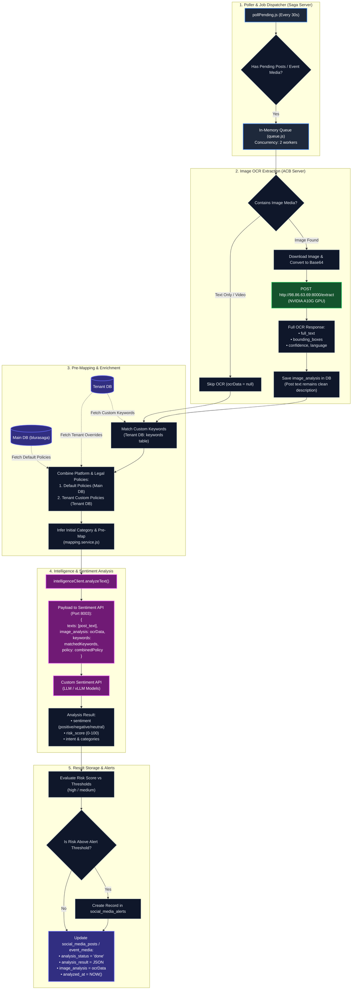

# Media & Sentiment Analysis Pipeline Architecture

This document describes the end-to-end processing pipeline for social media posts and event media within Blurasaga.

---

## 1. High-Level Flowchart



---

## 2. Detailed Pipeline Steps

### Step 1: Scheduling & Queue Dispatch
* **Component**: `src/services/media_post_analysis/pollPending.js` & `queue.js`
* **Schedule**: Background poller polls every 30 seconds for records where `analysis_status` is `pending` or `failed` (attempts < max).
* **Concurrency**: Managed by an in-memory queue with concurrency limits to prevent upstream API starvation.

### Step 2: GPU-Accelerated Image OCR
* **Component**: `src/services/media_post_analysis/extractOcr.js`
* **Target Server**: `acb` (`http://98.86.63.69:8000/extract`) running on an **NVIDIA A10G GPU**.
* **Behavior**:
  * Images are downloaded into memory and converted to Base64.
  * Sent to the OCR service which extracts detected text, bounding boxes, language, and confidence scores.
  * The full OCR response is retained in `image_analysis`.
  * The post's original description/text is kept intact (OCR is not appended into `post.text`).

### Step 3: Keywords & Combined Policy Resolution
* **Components**: `src/services/media_post_analysis/analyzeMediaPost.js`, `analyzeEventMedia.js`, and `src/modules/settings/mapping.service.js`
* **Custom Keywords**:
  * Scoped strictly to the tenant's custom keyword database (`keywords` table).
  * Text is matched against active keywords with case-insensitive tokenization.
* **Unified Policy Merging**:
  * **Default Policies**: Fetched from the global database (`default_policies` in `blurasaga`).
  * **Tenant Policies**: Fetched from the tenant's `policy_mappings` table.
  * The mapping engine merges both sources so standard platform rules and custom department policies are simultaneously considered.

### Step 4: Sentiment & Intelligence Call
* **Component**: `src/modules/intelligence/intelligence.client.service.js`
* **Target Server**: Sentiment API (`CUSTOM_SENTIMENT_URL`, port 8003)
* **Payload Structure**:
```json
{
  "texts": ["Full post content including image text..."],
  "image_analysis": {
    "full_text": "...",
    "bounding_boxes": [...],
    "language": "en"
  },
  "keywords": [
    { "keyword": "...", "weight": 50, "category": "other" }
  ],
  "policy": {
    "category_id": "Defamation",
    "platform_policies": [...],
    "legal_sections": [...]
  }
}
```

### Step 5: Database Persistence & Alerts
* **Components**: `social_media_posts`, `social_media_event_media`, `social_media_alerts`
* **Actions**:
  * Updates record with `analysis_status: 'done'`, `analysis_result`, `image_analysis`, and timestamp.
  * Evaluates computed `risk_score` against high and medium risk thresholds.
  * Automatically creates an alert in `social_media_alerts` if the risk threshold is met.
